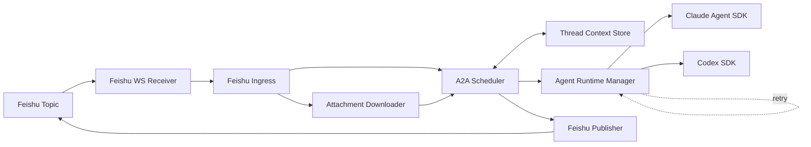

# Architecture



## Responsibilities

- **Receiver** (`src/feishu/receiver.js`): WS connection per receiver bot. Filters non-owned chats and bot-sent messages before handing the event off. Counts reconnect attempts and `process.exit(1)` once they exceed `A2A_WS_RECONNECT_GIVEUP` so systemd can rebuild the connection.
- **Ingress** (`src/feishu/ingress.js`): normalises a Feishu event into a `record` (root id, sender label, text, timestamps, attachments) and queues it on the scheduler.
- **Attachment Downloader** (`src/feishu/attachment-downloader.js`): downloads supported image resources from Feishu messages into `$A2A_HOME/attachments`, enforces image count/byte limits, and hands local image files to the agent runtimes.
- **Scheduler** (`src/scheduler/a2a-scheduler.js`): owns protocol state — session lifecycle, turn order, dedupe, `quietStreak`, `turnsSinceUser` cap, session-wide timeout, `/a2a stop|status` commands. Knows nothing about Feishu APIs or SDK internals.
- **Runtime Manager** (`src/runtime/agent-runtime-manager.js`): single facade in front of the Claude Agent SDK and Codex SDK runtimes. Owns per-agent state (`threadId`, `fullContextSent`, transcript / userUpdates cursors), per-turn timeout (`turnTimeoutMs`), and retry/backoff (`runtime/retry.js`).
- **Publisher** (`src/feishu/publisher.js`): posts agent and system messages back into the same Feishu thread with `reply_in_thread`. Skips empty agent content.
- **Store** (`src/store/thread-context-store.js`): JSON-backed persistence. `sessions.json` only holds `running` sessions; once finished, the thread is summarised into `sections.json` so resumes after restart still find prior `threadId`s.

## Session state shape

```jsonc
{
  "id": "fc9d2b8ee9",
  "status": "running",
  "appId": "cli_...",
  "chatId": "oc_...",
  "rootMessageId": "om_...",
  "triggerMode": "auto",
  "initialContext": "<formatted thread text>",
  "initialAttachments": [{ "kind": "image", "messageId": "om_...", "localPath": "$A2A_HOME/attachments/..." }],
  "userUpdates": [                    // every user message in this section, oldest first; the trigger is index 0
    { "messageId": "om_...", "sender": "Alice (user:open_...)", "msgType": "text", "text": "...", "attachments": [], "at": 1717000000000 }
  ],
  "transcript": [ { "speaker": "claude-code", "round": 1, "text": "...", "provider": "claude-agent-sdk", "at": 0 } ],
  "agentState": {
    "claude-code": { "threadId": "...", "fullContextSent": true, "transcriptDelivered": 1, "userUpdatesDelivered": 1 },
    "codex":       { "threadId": "...", "fullContextSent": true, "transcriptDelivered": 1, "userUpdatesDelivered": 1 }
  },
  "round": 2,
  "turnsSinceUser": 1,
  "quietStreak": 0,
  "waitingFor": { "cliId": "codex", "round": 2 },
  "createdAt": 0,
  "updatedAt": 0
}
```

User messages flow through a single `userUpdates` channel. The very first message is `userUpdates[0]`; subsequent messages append. Each agent advances its own `userUpdatesDelivered` cursor after every successful turn, so the prompt only carries new inputs since that agent last spoke. When a section ends and the user posts again into the same Feishu topic, `createSession` inherits `threadId` and `fullContextSent` from the prior `sections.json` entry but resets the cursors to `0`, and the new message lands as `userUpdates[0]` of the new session — so resumed agents see it via `<new_user_messages>` while their SDK threads continue.

## Termination conditions

The scheduler stops a session when **any** of these become true:

1. `/a2a stop|cancel|end` from a user (status → `stopped`).
2. `quietStreak >= agentOrder.length` — every agent returned empty in a row (status → `done`, reason `quiet`).
3. `turnsSinceUser >= maxTurnsSinceUser` — runaway guard (status → `done`, reason `max-turns`).
4. `Date.now() - createdAt > sessionTimeoutMs` — hard ceiling checked at the start of every `routeNext` (status → `done`, reason `session-timeout`).
5. Retries exhausted on a non-retryable error — runtime throws, session is marked `failed`.

There is no `decision` protocol and no per-agent role (reviewer / verifier). Both agents read the same prompt and the topic context, then contribute naturally.

## Retry semantics

`runtime/retry.js` classifies errors as retryable when any of:

- `err.code` ∈ `{ETIMEDOUT, ECONNRESET, ECONNREFUSED, ENETUNREACH, ENETDOWN, EAI_AGAIN, EPIPE, ERR_NETWORK}`
- HTTP `status` ∈ `{408, 429}` or `5xx`
- Message contains `timeout / timed out / network / socket hang up / rate limit / overloaded / temporarily unavailable`

Auth / 4xx / `invalid api key` / `model not found` short-circuit immediately. Each retry waits `min(capMs, baseMs * 2^attempt + jitter)`.
